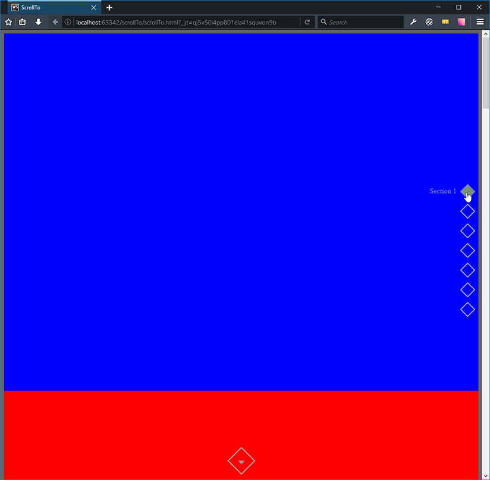

# ScrollTo Section using jQuery


## Overview
Simple example of how to scroll to a section of a page using jquery only.

- Create sections
- Create ScrollTo controls
- Align titles
- My jQuery script does the rest

## Steps
### Create Sections
Each section has a unique id.
```html
<div id="section1"></div>
<div id="section2"></div>
<div id="section3"></div>
<div id="section4"></div>
<div id="section5"></div>
<div id="section6"></div>
<div id="section7"></div>
``` 


### Create ScrollTo controls
From ScrollTo controls, target each page section using data-scrollTo-id attribute.
```html
<div id="scrollTo-controls">
    <div class="scrollTo-control" data-scrollTo-id="section1"><div class="control-title">Section 1</div></div>
    <div class="scrollTo-control" data-scrollTo-id="section2"><div class="control-title">Section 2</div></div>
    <div class="scrollTo-control" data-scrollTo-id="section3"><div class="control-title">Section 3</div></div>
    <div class="scrollTo-control" data-scrollTo-id="section4"><div class="control-title">Section 4</div></div>
    <div class="scrollTo-control" data-scrollTo-id="section5"><div class="control-title">Section 5</div></div>
    <div class="scrollTo-control" data-scrollTo-id="section6"><div class="control-title">Section 6</div></div>
    <div class="scrollTo-control" data-scrollTo-id="section7"><div class="control-title">Section 7</div></div>
</div>
<div class="center-control">
    <div id="control-next"></div>
</div>
```

### Align Titles
Go to .control-title in scrollTo.scss and manually align the titles using top and right properties.
```css
.control-title {
  display: none;
  position: relative;
  float: right;
  top: 38px;
  right: 20px;
  padding: 0;
  white-space: nowrap;
  color: #afacb2;
  @include transform(rotate(-45deg));

  &.displayTitle{
    display: block;
  }
}
``` 

### jQuery Script
My jQuery script does the rest.
```javascript
    (function ($) {

        //----------------------------------
        // Elements
        //----------------------------------
        var $scrollTo_control_1 = $('.scrollTo-control:eq(0)'),
            $scrollTo_control   = $('.scrollTo-control'),
            $control_next       = $('#control-next'),
            $window             = $(window);

        //----------------------------------
        // Events
        //----------------------------------
        $scrollTo_control_1.addClass('filled');

        $scrollTo_control.on('click', function(){
            fill_control($(this));
            scroll_to($(this).attr('data-scrollTo-id'));
        });

        $control_next.on('click', function(){
            var $next_sibling = determine_next_sibling($('.scrollTo-control.filled'));
            fill_control($next_sibling);
            scroll_to($next_sibling.attr('data-scrollTo-id'));
        });

        $scrollTo_control.hover(
            function(){
                $(this).find('.control-title').addClass('displayTitle');
            },
            function(){
                $(this).find('.control-title').removeClass('displayTitle');
            }
        );

        $window.scroll(function(){
            if ($window.scrollTop() === 0){
                $scrollTo_control.removeClass('filled');
                $scrollTo_control_1.addClass('filled');
                $control_next.removeClass('inverted');
            }
        });
        
        //----------------------------------
        // Functions
        //----------------------------------
        function fill_control($this){
            $scrollTo_control.removeClass('filled');
            $this.addClass('filled');
        }

        function scroll_to(scrollToId){
            if (scrollToId === $scrollTo_control_1.attr('data-scrollTo-id')){
                scrollToId = 'html, body';
                $control_next.addClass('inverted');
            }
            else {
                scrollToId = '#' + scrollToId;
            }
            $('html, body').animate({
                scrollTop: $(scrollToId).offset().top
            }, 1000);
        }

        function determine_next_sibling($this){
            if ($this.next().length == 0){
                return $scrollTo_control_1;
            }
            else {
                return $this.next();
            }
        }

    })(jQuery);
```

## TODO
Auto align variable width ScrollTo control titles.